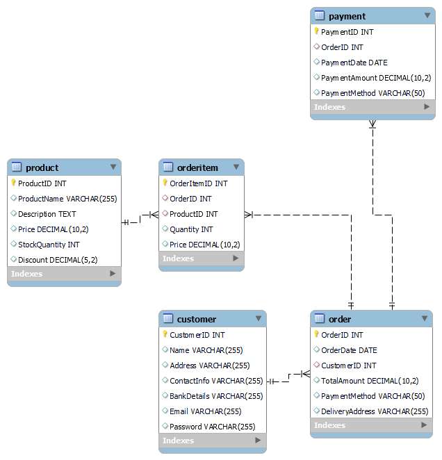

# Online Retail Application Database

## Overview
This project involves building an online retail application database using SQL. The database supports customer registration, product purchases, and payment processing.

## ER Diagram
  

## Tables
1. **Customer**: Stores customer information.
2. **Product**: Stores product details.
3. **Order**: Stores order information.
4. **OrderItem**: Stores details of each product in an order.
5. **Payment**: Stores payment details.

